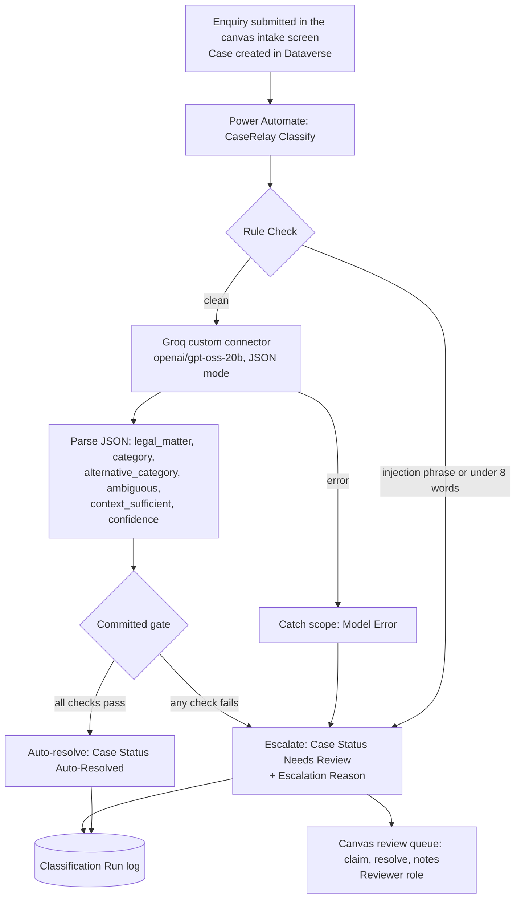

# Architecture

```mermaid
flowchart TD
    A[Enquiry submitted in the canvas intake screen<br/>Case created in Dataverse] --> B[Power Automate: CaseRelay Classify]
    B --> C{Rule Check}
    C -->|injection phrase or under 8 words| E
    C -->|clean| D[Groq custom connector<br/>openai/gpt-oss-20b, JSON mode]
    D -->|error| X[Catch scope: Model Error]
    X --> E
    D --> F[Parse JSON: legal_matter, category,<br/>alternative_category, ambiguous,<br/>context_sufficient, confidence]
    F --> G{Committed gate}
    G -->|all checks pass| H[Auto-resolve: Case Status Auto-Resolved]
    G -->|any check fails| E[Escalate: Case Status Needs Review<br/>+ Escalation Reason]
    H --> L[(Classification Run log)]
    E --> L
    E --> Q[Canvas review queue: claim, resolve, notes<br/>Reviewer role]
```

Environment variables (not secrets): Classifier Model, Confidence Threshold, Minimum Word Count.
The Groq API key lives only in the connection, never in the solution.
